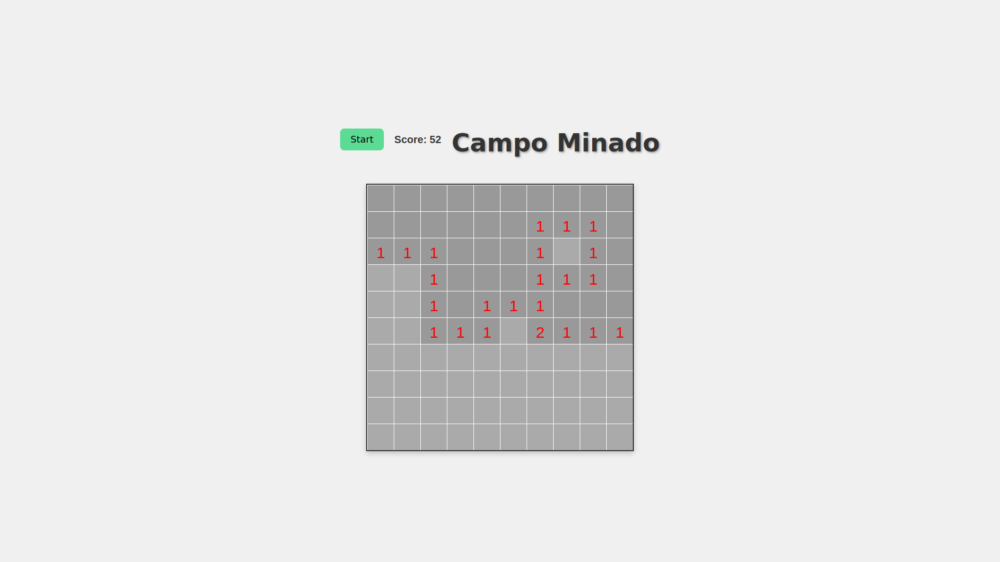
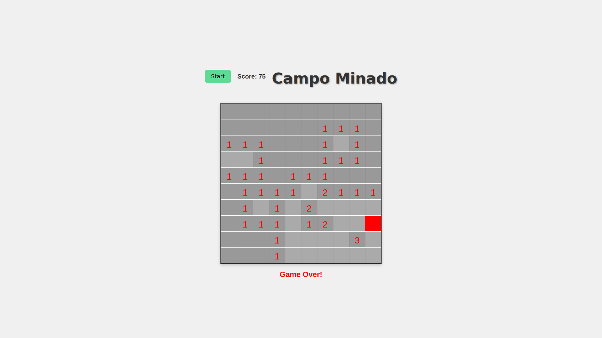

Nome da equipe: Standalone

Equipe: 
José Wilson dos Santos Junior

Campo Minado 🎮

Este projeto implementa uma versão simplificada do clássico Campo Minado (Minesweeper) usando HTML5, CSS e JavaScript.

🕹 Como jogar

Clique no botão Start para iniciar o jogo.

Clique com o botão esquerdo do mouse em qualquer célula para revelá-la.

Evite clicar nas bombas (quadrados vermelhos), ou será Game Over.

O score é atualizado com base na quantidade de células abertas sem bomba.

📦 Estrutura dos arquivos

index.html — Estrutura principal do jogo.

style.css — Estilização visual da página.

javascript.js — Lógica do jogo (gerar grade, distribuir bombas, tratar cliques etc).

🧠 Regras do jogo

O campo é uma grade 10x10.

Existem 10 bombas escondidas aleatoriamente.

Cada célula pode mostrar quantas bombas estão ao seu redor.

Células vazias sem bombas ao redor se abrem automaticamente em cascata.

🚀 Tecnologias usadas

HTML5

CSS3

JavaScript (paradigma funcional, sempre que possível)

Canvas API (para desenhar a interface do jogo)

📸 Imagem de exemplo 

Este projeto é um trabalho para fins acadêmicos sem quaisquer intenções de uso comercial, ele é baseado no jogo minesweeper da microsoft

Bibliografia:
A simplicidade do Campo Minado!! (Animação) https://www.youtube.com/watch?v=A13E7NjQPtg (youtube video)
Como criar o jogo CAMPO MINADO usando Javascript e HTML - parte 1/2 https://www.youtube.com/watch?v=zaEMcuSPdKc (youtube video)
Como criar o jogo CAMPO MINADO usando Javascript e HTML - parte 2/2 https://www.youtube.com/watch?v=0zRqRLmBz80 (youtube video)
